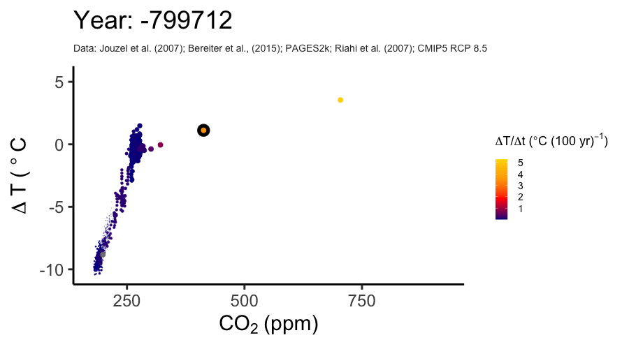

```{r setup, include=FALSE}
# global options for "knitting"
knitr::opts_chunk$set(
  echo = TRUE,
  warning = FALSE,
  message = FALSE
)
```

```{r, include=FALSE}
library(dplyr)
library(tidyr)
library(purrr)
library(lubridate)
library(readr)
library(ggplot2)
library(gganimate)
library(gifski)
library(here)
library(readr)

source(here("R/analyse_modobs2.R"))
```

## Read data
### CO<sub>2</sub> 

I'm reading in the unified CO<sub>2</sub> reconstructions by @bereiter15grl and RCP8.5 standard forcing CO<sub>2</sub>.
```{r}
df_co2_bereiter <- read_csv(here("data-raw/co2_composite.csv")) %>%
  mutate(year_ce = 1950 - age_yrBP) %>%
  rename(co2_ppmv_bereiter = co2_ppmv)

# df_co2_rcp85 <- read_csv("~/data/co2/cCO2_rcp85_const850-1765.csv") %>%
df_co2_rcp85 <- read_table(
  here("data-raw/cCO2_rcp85_const850-1765.dat"),
  col_names = c("year", "co2")
) %>%
  mutate(age_yrBP = 1950 - year) %>%
  rename(year_ce = year, co2_ppmv_rcp85 = co2)

df_co2_bereiter %>%
  ggplot(aes(x = -age_yrBP, y = co2_ppmv_bereiter)) +
  geom_line() +
  xlim(-11000, 1750)

ggplot() +
  geom_line(
    data = df_co2_rcp85, 
    aes(x = year_ce, y = co2_ppmv_rcp85), 
    col = "red"
    ) +
  geom_line(
    data = df_co2_bereiter, 
    aes(x = year_ce, y = co2_ppmv_bereiter)
    ) +
  xlim(1950, 2050) +
  ylim(280, 600)
```

Let's unify the datasets by interpolating Bereiter data to regular time steps (years corresponding to the RCP8.5 dataset) and make them transition smoothly by scaling the RCP8.5 curve to match observations from the Bereiter dataset over the last 10 years of the latter dataset.
```{r}
# get years in the rcp dataset
years_rcp85 <- df_co2_rcp85 %>%
  # filter(year_ce <= 2001) %>%
  pull(age_yrBP)

# interpolate bereiter values to each year in the rcp dataset
df_co2_bereiter_interpol <- approx(
  x = df_co2_bereiter$age_yrBP,
  y = df_co2_bereiter$co2_ppmv_bereiter,
  xout = years_rcp85,
  method = "linear"
) %>%
  as_tibble() %>%
  rename(age_yrBP = x, co2_ppmv_bereiter = y) %>%
  mutate(interpolated = TRUE) %>%
  mutate(year_ce = 1950 - age_yrBP, sigma_co2_ppmv = NA)

df_co2_bereiter_interpol %>%
  ggplot(aes(x = -age_yrBP, y = co2_ppmv_bereiter)) +
  geom_line()

# combine the two datasets: bereiter original and bereiter interpolated
df_co2_bereiter <- df_co2_bereiter %>%
  mutate(interpolated = FALSE) %>%
  bind_rows(., df_co2_bereiter_interpol) %>%
  arrange(age_yrBP)

# test plot: ok, still all here
df_co2_bereiter %>%
  filter(interpolated) %>%
  ggplot(aes(x = -age_yrBP, y = co2_ppmv_bereiter)) +
  geom_line()

# test plot: rcp dataset
ggplot() +
  geom_line(data = df_co2_rcp85, aes(x = year_ce, y = co2_ppmv_rcp85), col = "red") +
  geom_line(data = df_co2_bereiter, aes(x = year_ce, y = co2_ppmv_bereiter)) +
  xlim(800, 2100)

# merge rcp into bereiter
df_co2 <- df_co2_bereiter %>%
  left_join(df_co2_rcp85, by = c("age_yrBP", "year_ce"))

# take mean over last 10 years
f_offset <- df_co2 %>%
  filter(year_ce == 2001) %>%
  summarise_all(list(mean), na.rm = TRUE) %>%
  rowwise() %>%
  mutate(f_offset = co2_ppmv_bereiter / co2_ppmv_rcp85) %>%
  pull(f_offset)

# rescale RCP8.5 data to match Bereiter
df_co2 <- df_co2 %>%
  mutate(co2_ppmv_rcp85_corr = f_offset * co2_ppmv_rcp85) %>%
  mutate(co2_ppmv_combined = ifelse(is.na(co2_ppmv_bereiter), co2_ppmv_rcp85_corr, co2_ppmv_bereiter))

# write to file
write_csv(
  df_co2,
  file = here("data/df_co2.csv")
)

df_co2 %>%
  ggplot() +
  geom_line(aes(x = year_ce, y = co2_ppmv_rcp85), col = "red", alpha = 0.4) +
  geom_line(aes(x = year_ce, y = co2_ppmv_rcp85_corr), col = "red") +
  geom_line(aes(x = year_ce, y = co2_ppmv_bereiter)) +
  geom_line(aes(x = year_ce, y = co2_ppmv_combined), col = "darkgreen") +
  xlim(1950, 2050) +
  ylim(280, 600)
```

### Temperature

#### EPICA DOME C

```{r}
df_temp_epica_daag <- read_csv(here("data-raw/edcT.csv")) %>%
  rename(age_yrBP = Age) %>%
  mutate(year_ce = 1950 - age_yrBP)

df_temp_epica_noaa <- read_fwf(
  here("data-raw/edc3deuttemp2007.txt"),
  fwf_widths(c(5, 13, 17, 13, 13), c("Bag", "ztop", "age_yrBP", "Deuterium", "dT")),
  skip = 92
) %>%
  mutate(year_ce = 1950 - age_yrBP)

ggplot() +
  geom_line(data = df_temp_epica_daag, aes(x = -age_yrBP, y = dT)) +
  geom_line(data = df_temp_epica_noaa, aes(x = -age_yrBP, y = dT), col = "red")

df_temp_epica <- df_temp_epica_daag %>%
  left_join(df_temp_epica_noaa, by = "age_yrBP")

df_temp_epica %>%
  analyse_modobs2(mod = "dT.x", obs = "dT.y")
# ==> datasets are identical!
```

#### PAGES 2K

```{r}
df_temp_pages2k <- read_delim(
  here("data-raw/Full_ensemble_median_and95pct_range.txt"),
  delim = "\t",
  skip = 6
) %>%
  rename(year_ce = Year) %>%
  mutate(age_yrBP = 1950 - year_ce)

ggplot() +
  # geom_line(data = df_temp_epica_noaa, aes(x = year_ce, y = dT), col = "red") +
  geom_line(
    data = df_temp_pages2k, 
    aes(x = year_ce, y = median), 
    col = "grey70"
    ) +
  geom_ribbon(
    data = df_temp_pages2k, 
    aes(x = year_ce, ymin = p2_5_31yr_filtered, ymax = p97_5_31yr_filtered), 
    fill = "black", 
    alpha = 0.2
    ) +
  geom_line(
    data = df_temp_pages2k, 
    aes(x = year_ce, y = median_31yr_filtered), 
    col = "black"
    ) +
  xlim(0, 2000)
xlim(-20000, 2000)
```

#### RCP/CMIP5

```{r}
df_temp_cmip <- read_csv(here("data-raw/df_temp_cmip.csv"))

df_temp_cmip_mean <- df_temp_cmip %>%
  dplyr::select(time, starts_with("dT_")) %>%
  pivot_longer(starts_with("dT_"), names_to = "model", values_to = "dT") %>%
  group_by(time) %>%
  summarise(dT = mean(dT, na.rm = TRUE)) %>%
  rename(year_ce = time, dT_cmip = dT)

df_temp_cmip_mean %>%
  ggplot(aes(x = year_ce, y = dT_cmip)) +
  geom_line()

df_temp_cmip %>%
  dplyr::select(time, starts_with("dT_")) %>%
  pivot_longer(starts_with("dT_"), names_to = "model", values_to = "dT") %>%
  ggplot(aes(x = time, y = dT, color = model)) +
  geom_line()
```

Let's combine the three temperature datasets by using Jouzel before 0 CE and using Pages2k after 0 CE. Correct CMIP data to match PAGES2k data (mean of 90s).
```{r}
df_temp_a <- df_temp_epica_noaa %>%
  dplyr::select(year_ce, dT) %>%
  filter(year_ce < 0)

df_temp_b <- df_temp_pages2k %>%
  dplyr::select(year_ce, dT = median)

df_temp <- df_temp_a %>%
  bind_rows(df_temp_b) %>%
  arrange(-year_ce)

df_temp <- df_temp %>%
  left_join(df_temp_cmip_mean, by = "year_ce") %>%
  bind_rows(
    df_temp_cmip_mean %>%
      filter(year_ce > 2017) %>%
      mutate(dT = NA),
    .
  ) %>%
  arrange(-year_ce)

## offset cmip
df_temp_mean90s <- df_temp %>%
  filter(year_ce > 1990 & year_ce <= 2000) %>%
  summarise(dT_cmip = mean(dT_cmip), dT = mean(dT))

df_temp <- df_temp %>%
  mutate(dT_cmip = dT_cmip - df_temp_mean90s$dT_cmip + df_temp_mean90s$dT)

# write to file
write_csv(
  df_temp,
  file = here("data/df_temp.csv")
)

ggplot() +
  geom_point(data = df_temp_epica_noaa, aes(x = year_ce, y = dT), col = "tomato") +
  geom_line(data = df_temp_pages2k, aes(x = year_ce, y = median), col = "grey70") +
  geom_ribbon(data = df_temp_pages2k, aes(x = year_ce, ymin = p2_5_31yr_filtered, ymax = p97_5_31yr_filtered), fill = "black", alpha = 0.2) +
  geom_line(data = df_temp_pages2k, aes(x = year_ce, y = median_31yr_filtered), col = "black") +
  geom_line(data = df_temp, aes(year_ce, dT), alpha = 0.6, col = "royalblue") +
  geom_line(data = df_temp, aes(year_ce, dT), alpha = 0.6, col = "royalblue") +
  xlim(-20000, 2000)

df_temp %>%
  filter(year_ce > 1849) %>%
  pivot_longer(c(dT, dT_cmip), names_to = "source", values_to = "dT") %>%
  ggplot(aes(x = year_ce, y = dT, color = source)) +
  geom_line()
```

Now, fill column `dT` with offset-corrected CMIP data (mean across models).
```{r}
df_temp <- df_temp %>%
  mutate(dT = ifelse(is.na(dT), dT_cmip, dT))

df_temp %>%
  ggplot(aes(x = year_ce, y = dT)) +
  geom_line()
```


## Combine CO<sub>2</sub> and temperature

Combine the two with common years.
```{r}
years_out <- seq(from = -800000, to = 2300, by = 1)
df_co2 <- df_co2 %>% 
  arrange(-year_ce)

df_combined <- approx(
  x = df_co2$year_ce,
  y = df_co2$co2_ppmv_combined,
  xout = years_out,
  method = "linear"
) %>%
  as_tibble() %>%
  rename(year_ce = x, co2 = y) %>%
  left_join(
    approx(
      x = df_temp$year_ce,
      y = df_temp$dT,
      xout = years_out,
      method = "linear"
    ) %>%
      as_tibble() %>%
      rename(year_ce = x, dT = y),
    by = "year_ce"
  )
```

Combine $\Delta T$ and CO$_2$ time series, spline the curves, and get the change rate for CO<sub>2</sub> and temperature
```{r}
## calculate splines of temperature and co2 for the animation, and...
## get rate of temperature change from slope of spline
df_combined <- df_combined %>%
  drop_na(dT, co2)

df_combined_sub <- df_combined %>%
  slice(c(seq(1, 800000, by = 100), 800001:nrow(.)))

dT_smoothed <- smooth.spline(
  x = df_combined_sub$year_ce, 
  y = df_combined_sub$dT, spar = 0.000001
  )$y

co2_smoothed <- smooth.spline(
  x = df_combined_sub$year_ce, 
  y = df_combined_sub$co2, 
  spar = 0.000001
  )$y

# co2_smoothed <- loess( co2 ~ year_ce, span=10/nrow(df_combined), data = df_combined )

df_combined_sub <- df_combined_sub %>%
  mutate(dT_splined = dT_smoothed, co2_splined = co2_smoothed) %>%
  mutate(dtime = year_ce - lag(year_ce, 1)) %>%
  mutate(dT_changerate = 100 * abs(dT_splined - lag(dT_splined, 1)) / dtime) %>%
  mutate(
    co2_highlight = ifelse(year_ce %in% c(2020, 2100, 2200, 2300), co2, NA),
    dT_highlight = ifelse(year_ce %in% c(2020, 2100, 2200, 2300), dT, NA)
  )

ggplot() +
  geom_line(data = df_combined %>% filter(year_ce > 1500), aes(x = year_ce, y = dT)) +
  geom_point(data = df_combined_sub %>% filter(year_ce > 1500), aes(x = year_ce, y = dT_highlight), size = 4) +
  geom_point(data = df_combined_sub %>% filter(year_ce > 1500), aes(x = year_ce, y = dT), color = "red") +
  geom_line(data = df_combined_sub %>% filter(year_ce > 1500), aes(x = year_ce, y = dT_splined), color = "royalblue", size = 1) +
  xlim(1500, 2300)

ggplot() +
  geom_line(
    data = df_combined %>% 
      filter(year_ce > 1500), 
    aes(x = year_ce, 
        y = co2)
    ) +
  geom_point(
    data = df_combined_sub %>% 
      filter(year_ce > 1500), 
    aes(x = year_ce, y = co2_highlight), 
    size = 4
    ) +
  geom_point(
    data = df_combined_sub %>% 
      filter(year_ce > 1500), 
    aes(x = year_ce, y = co2), 
    color = "red"
    ) +
  geom_line(
    data = df_combined_sub %>% 
      filter(year_ce > 1500), 
    aes(x = year_ce, 
        y = co2_splined), 
    color = "royalblue", 
    size = 1
    ) +
  xlim(1500, 2300)

df_combined_sub %>%
  filter(year_ce > -400000 & year_ce < -300000) %>%
  ggplot() +
  geom_point(aes(x = year_ce, y = dT), color = "red") +
  geom_line(aes(x = year_ce, y = dT_splined), color = "royalblue", size = 1) +
  xlim(-400000, -300000)

df_combined_sub %>%
  filter(year_ce > -400000 & year_ce < -300000) %>%
  ggplot() +
  geom_point(aes(x = year_ce, y = co2), color = "red") +
  geom_line(aes(x = year_ce, y = co2_splined), color = "royalblue", size = 1) +
  xlim(-400000, -300000)
```


### Time series

```{r}
gg_tseries <- df_combined_sub %>%
  # filter(year_ce < 2300) %>%
  filter(year_ce < 2300) %>%
  ggplot() +
  geom_line(aes(x = -(1950 - year_ce) / 1000, y = ((co2 - 270) / 10)), alpha = 1, col = "tomato") +
  geom_line(aes(x = -(1950 - year_ce) / 1000, y = dT), alpha = 1, col = "royalblue3") +
  scale_y_continuous(sec.axis = sec_axis((~ . * 10 + 270), name = expression(paste("CO2"[2], " (ppm)")))) +
  labs(
    y = expression(paste(Delta, "T (", degree, "C)")),
    x = "kyr BP"
  ) +
  theme_classic(base_size = 20) +
  theme(
    axis.text.y.right = element_text(colour = "tomato"),
    axis.ticks.y.right = element_line(colour = "tomato"),
    axis.title.y.right = element_text(colour = "tomato"),
    axis.text.y = element_text(colour = "royalblue3"),
    axis.ticks.y = element_line(colour = "royalblue3"),
    axis.title.y = element_text(colour = "royalblue3"),
    axis.line.y = element_line(colour = "royalblue3"),
    axis.line.y.right = element_line(colour = "red")
  ) +
  labs(
    title = expression(paste("Global temperature and atmospheric CO"[2])),
    subtitle = "Jouzel et al. (2007); Bereiter et al., (2015)"
  )

gg_tseries
ggsave(here("figures/tseries_co2_temperature.pdf"), width = 7 * 1.5, height = 5 * 1.5)
```

### Spiral

```{r, eval=FALSE}
# This chunk is not executed because it takes too long.
# Instead, read plot object from file in next chunk.

# pre-1750
gg_spiral <- df_combined_sub %>%
  filter(year_ce <= 2100) %>%
  mutate(age_kyrbp = (1950 - year_ce) / 1000) %>%
  ggplot() +
  geom_point(aes(x = co2_highlight, y = dT_highlight), size = 8) +
  geom_point(aes(x = co2, y = dT, color = dT_changerate), size = 3) +
  scale_color_gradientn(
    colours = c("darkblue", "red", "orange", "gold"),
    name =
      expression(
        paste(
          Delta,
          "T/",
          Delta,
          "t (",
          degree,
          "C (100 yr)"^{
            -1
          }, ")"
        )
      )
  ) +
  labs(
    x = bquote(CO[2] ~ "(ppm)"),
    y = bquote(Delta ~ "T (" ~ degree ~ "C"),
    subtitle = "Data: Jouzel et al. (2007); Bereiter et al., (2015); PAGES2k; Riahi et al. (2007); CMIP5 RCP 8.5"
  ) +
  theme_classic(base_size = 30) +
  theme(
    legend.text = element_text(size = 14),
    plot.subtitle = element_text(size = 14, color = "grey20"),
    legend.title = element_text(size = 18),
    panel.background = element_rect(fill = "transparent"), # bg of the panel
    plot.background = element_rect(fill = "transparent", color = NA), # bg of the plot
    legend.background = element_rect(fill = "transparent", color = NA), # get rid of legend bg
    legend.box.background = element_rect(fill = "transparent", color = NA) # get rid of legend panel bg
  ) +
  transition_time(year_ce) +
  shadow_wake(wake_length = 0.1, alpha = FALSE) +
  enter_fade() +
  exit_shrink() +
  ease_aes("sine-in-out") +
  labs(title = "Year: {round(frame_time, 0)}")

a_gif <- animate(
  gg_spiral,
  detail = 50,
  nframes = 300,
  width = 900,
  height = 500,
  fps = 15,
  renderer = gifski_renderer(here("figures/gganim_spiral.gif"), loop = FALSE)
)
```




## References
